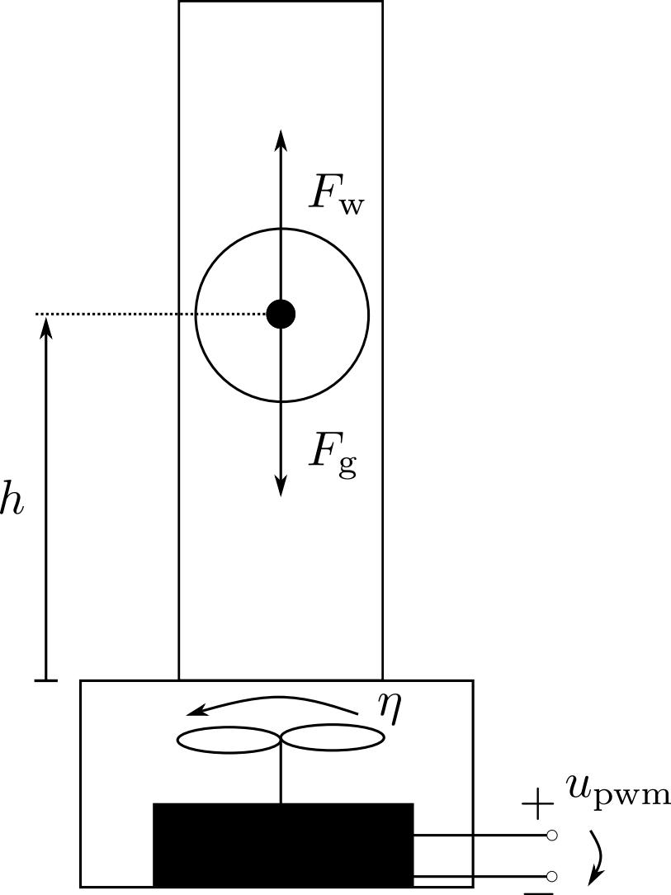
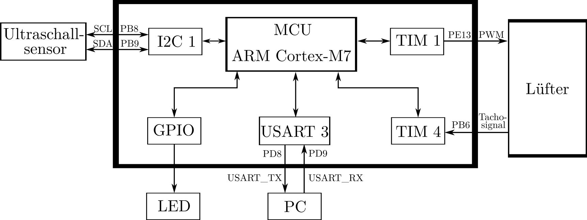
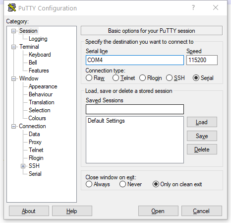

# Umsetzung des Schwebkörpers

In diesem Dokument geht's um die Inbetriebnahme vom Schwebekörper-Versuchsstand. Das NMPC-Verfahren mit exaktem Endzustand wird für den Schwebekörper auf einem STM32F767-Bord implementiert.



## Beginnen

Um den Versuchsstand zu initialisieren, müssen die folgenden Vorbereitungen verfertigt und  das Bord richtig mit dem Versuchstand verbunden werden.


These instructions will get you a copy of the project up and running on your local machine for development and testing purposes. See deployment for notes on how to deploy the project on a live system.

### Voraussetzungen

Hardware 

1. PC mit Linux Betriebssystem
2. STM32F767

Software

1. arm-none-eabi-gcc  
2. stlink
3. ACADO Toolkit


### Verbinden des Bords mit dem Versuchsstand

Pin-Definitionen des STM-Bord finden Sie hier: [NUCLEO-F767ZI](https://os.mbed.com/platforms/ST-Nucleo-F767ZI/) 


| Funktionalität der GPIOs | Auswahl der alternativen Funktionen | Pins |   Versuchsstand   |
| :----------------------: | :---------------------------------: | :--: | :---------------: |
|         TIM_OUT          |            PWM1/3 (AF1)             | PE13 |      Lüfter       |
|          TIM_IN          |            PWM4/1 (AF2)             | PB6  |      Lüfter       |
|         I2C SCL          |            I2C1 SCL(AF4)            | PB8  | Ultraschallsensor |
|         I2C SDA          |            I2C1 SDA(AF4)            | PB9  | Ultraschallsensor |
|         USART TX         |           USART3_TX(AF7)            | PD8  |        PC         |
|         USART RX         |           USART3_RX (AF7)           | PD9  |        PC         |




PS: Zusätzliche Verbindung zwischen dem Motor-Shield und einem verwendeten Pin benötig, weil das Pin nicht direkt mit dem verfügbaren Motor-Shield verbinden kann.

### Installation der Software

#### arm-none-eabi-gcc 

1. arm-none-eabi-gcc mit Version 8.3.1 als Kompiler wird für das Projekt verwendet. Herunterladen der Source-Code von der [Linke](https://developer.arm.com/tools-and-software/open-source-software/developer-tools/gnu-toolchain/gnu-rm/downloads): Auswählen der 8-2019-q3-update. 
2. Entpacken der Source-Code
3. Aktualisieren der Path-Variable dadurch: Eingabe der Pfad vom gcc-arm-none-eabi in .bashrc:
```bash
export PATH=/path/goes/here/gcc−arm−none−eabi/bin:$PATH
```
4. Aufrufe der .bashrc-Datei:

```bash
source .bashrc
```
5. Bestätigung der richtigen installation:

```bash
arm-none-eabi-gcc --version
```
Falls die richtigen Version-Informationen ausgegeben werden, ist der erste Schritt bis hier fertig.


PS: Falls Fehlermeldung auftritt, ist sehr möglich, dass GNU-C-Bibliothek oder andere Pakete installiert werden müssen. Lösung: Installation der Pakete anhand der Fehlermeldung.


#### stlink

1. Um die ausführbare Code auf dem Mikrokontroller zu flashen und debugen, ist die Software stlink angefordert. Die verwendete Version ist v1.5.1
2. Installationsanleitung anhand der folgenden Linke unter dem Teil von LInux: [stlink-Installation](https://github.com/stlink-org/stlink/blob/develop/doc/compiling.md)


#### ACADO Toolkit

1. ACADO Toolkit ist eine Software-Umgebung für Simulation der optimalen Steuerung und Code-Generation der MPC-Regler.  Programm wird in C++ geschrieben und dann in C exportiert.
2. Installationsanleitung anhand der folgenden Linke: [ACAO-Installation](https://acado.github.io/install_linux.html)


## Ausführen des Tests

Im Verzeichnis **project_schwebekoerper** steht schon eine ausführbare Datei schwebekoerper.bin zur Verfügung. Was zu tun ist, die Datei schwebekoerper.bin auf dem Bord zu hochladen(flashen). Nach richtiger Verbindung des Nucleo-Bord mit dem Versuchsstand, ist die folgende Befehl auszuführen:

```bash
st-flash write schwebekoerper.bin 0x8000000
```

Um die richtige Informationen der seriellen Kommunikation, die durch USART in PC eingegeben werden, wird eine Software für die Kommunikation gefordert. Folgend Möglichkeiten sind verfügbar:

1. Kommunikation durch Putty für ein PC mit einem Windows Betriebsystem.

   1. Nach dem Flashen der bin-Datei verbinden das Bord mit einem Windows-PC. 

   2.  Eingeben das richtige Port der Kommunikation und Baudrate. ([How to find your COM port]([https://hy-bon.com/files/4814/4250/7490/com_port_vista.pdf#:~:text=When%20the%20device%20manager%20shows,beside%20it%20to%20expand%20it.&text=If%20you%20are%20using%20a,as%20a%20%22Communications%20Port%22.&text=If%20you%20are%20using%20a%20USB%20to%20Serial%20Adapter%2C%20it,a%20%22USB%20Serial%20Port%22.](https://hy-bon.com/files/4814/4250/7490/com_port_vista.pdf#:~:text=When the device manager shows,beside it to expand it.&text=If you are using a,as a "Communications Port".&text=If you are using a USB to Serial Adapter%2C it,a "USB Serial Port".)))

      

oder

2. Verwenden stty auf Linux-System oder WSL-System (Windows Subsystem for Linux)

   1. Finden die Shell-Skripte under dem Verzeichnis \project_schwebekoerper\script

   2. Geben ein richtiges Port-Pferd ein

   3. Ausführen ssty_start.sh mit

      ```bash
      sh ssty_start.sh
      ```

Damit werden die Messdaten jeder schleife empfangen. 

## Entwicklungsweg

1. Entwickelung des Acado-Modells für den Schwebekörper 
   1. /schwebekoerper_umsetzung/schwebekoerper_acado/schwebekoerper.cpp

2. Änderung der eingebetteten Code 
   1. /schwebekoerper_umsetzung/project_schwebekoerper/src/acado_function.c
3. Einstellung und Initialisierung des Bords
   1. /schwebekoerper_umsetzung/project_schwebekoerper/src/main.c
   2. /schwebekoerper_umsetzung/project_schwebekoerper/src/stm32f7xx_it.c
   3. /schwebekoerper_umsetzung/project_schwebekoerper/Inc
4. Erzeugung der ausführbaren Datei durch Makefile
   1. /schwebekoerper_umsetzung/project_schwebekoerper/Makefile

### Entwickelung des ACADO-Modells für den Schwebekörper

#### Schritt 1: Definition des NMPC-Problems in ACADO-Syntax

Das Regelungsproblem des Schwebekörpers wird in C++-Datei definiert und danach in C-Datei für das eingebettete System exportiert. Folgende Schritte werden in der Datei **schwebekoerper.cpp** angefordert:

1. Definieren des Zustands und der Stellgröße 
2. Eingeben des Zeitkontinuierlichen Modells des Schwebekörpers 
3. Definieren der Gewichtungsmatrix, Endgewichtungsmatrix und Zielfunktion  definieren
4. Eingeben der Beschränkungen und Randbedingungen 
5. Auswählen der Funktionalität der exportierten Dateien

Detailliert findet man im [Tutorial des ACADO-Toolkits](http://acado.sourceforge.net/doc/pdf/acado_manual.pdf) in Kapitel 15.


#### Schritt 2: Kompilierung der Source-Code

Die geschriebene C++-Datei wird nach den folgenden Schritten in C-Dateien exportiert.

1. Erzeugen der Makefile durch Cmake

   1. PS. 2 Dinge in Cmake zu ändern

      1. Ein weiteres Flag für Kompilierung muss eingesetzt, ansonst tritt Kompilierungsfehler auf. Durch:

      ```cmake
      if(UNIX)
      		SET(CMAKE_CXX_FLAGS "${CMAKE_CXX_FLAGS}  -std=c++0x")	
      endif()
      ```

      2. Ausführbare Zieldatei, Source-C++-Datei und Ziel-Linke-Bibliothek müssen erneut anhand der Datei-Namen angepasst werden.

2. Ausführen cmake-file und erzeugen make-file für Kompilierung im Verzeichnis build:

   ```bash
   cmake .\build
   ```

3. Erzeugen der ausführbaren Datei

   ```shell
   make
   ```

4. Ausführen der Datei, um eingebettete Dateien zu erzeugen

   ```shell
   ./schwebekoerper
   ```

Bis hier erhält die benötigten Dateien für die eingebettete Implementierung.


PS. Weder eine Ruhelage als Referenz noch eine Referenz-Trajektorie soll in C++-Datei eingegeben. Wenn eine Referenz in C++-Datei definiert wird, triff ein Export-Fehler. Die Referenz soll in den erzeugten eingebetteten Dateien erneuert eingegeben werden.

### Änderung der eingebetteten Code 

In /schwebekoerper_umsetzung/project_schwebekoerper/src/acado_function werden Referenz, das gemessene aktuelle Zustand und Initialisierung der Zustände und Eingaben definiert. 

### Einstellung und Initialisierung des Bords

Der Teil beschreibt, wie die Parameter ausgewählt werden und wie das Bord initialisiert wird. Alle  folgenden Einstellungen werden mithilfe der verfügbaren HAL-APIs geschrieben. User-Manual findet man [hier](https://www.st.com/resource/en/user_manual/dm00189702-description-of-stm32f7-hal-and-lowlayer-drivers-stmicroelectronics.pdf).

Die benötigten HAL-Source-Codes und -Headers sind schon im Verzeichnis /schwebekoerper_umsetzung/project_schwebekoerper/STM32F7xx_HAL_Driver verfügbar.

#### GPIO Einstallung

1. TIM_OUT: PE13, PWM1/3 (AF1)
2. TIM_IN(capture): PB6 PWM4/1 (AF2)
3. I2C1: PB8 SCL(AF4), PB9 SDA(AF4)
4. USART3:  PD8 USART3_TX(AF7), PD9 USART3_RX (AF7)

#### UART

1. read data:  UART_Receive_IT

   1. Interruptsweg: 

      interrupt ->USART3_IRQHandler-> HAL_UART_IRQHandler ->  UART_Receive_IT ->(process receiving till --huart->RxXferCount == 0U) ->  HAL_UART_RxCpltCallback

#### Timer

1. Interruptsweg: HAL_TIM_IC_Init -> HAL_TIM_IC_MspInit

2. TIM4_Config -> HAL_TIM_PWM_Init ->  HAL_TIM_PWM_MspInit

3. TIM4 setting:

   Moterfrequenz: $2000-6000 \frac{1}{\min}$ -> $\frac{100}{3}  - 100 \frac{1}{s}$  -> capture 30-150 Hz signal

   $\frac{54 \times 10^6}{(30-1+1)\times(60000-1+1)}$ = 30

#### Interrupt

1. Handler wird  in startup_.s definiert


#### I2C

1. Auswählen der Parameter
   1. clock source and frequency. clock source can be chosen among PCK1(APB1 clock), HSI and SYSCLK. The value of PCK1 can be read from system clock setting with APB1 Prescaler   = 4(216Mhz /4 = 54Mhz)
   2. Timing setting. $t_{I2CCLK} = 1/(54 MHz)$ = 18,5185 ns

| PRESC                                     | SCLL                                   | SCLH                                   | SCLDEL                                                       | SDADEL                    |
| ----------------------------------------- | -------------------------------------- | -------------------------------------- | ------------------------------------------------------------ | ------------------------- |
| Prescaler                                 | SCL low                                | SCL high                               | SCL delay                                                    | SDA delay                 |
| $t_{PRESC}=(PRESC + 1) \times t_{I2CCLK}$ | $t_{SCLL}=(SCLL + 1) \times t_{PRESC}$ | $t_{SCLH}=(SCLH + 1) \times t_{PRESC}$ | 1000ns+250ns=1250ns = 1,25us<br/>1,25 / 0.24 = 5,21 <br/>5,21 - 1 <= SCDEL  -> SCDEL >=5 |                           |
| PRESC = 12 = 0xC                          | SCLL = 20 =  0x14                      | SCLH = 0x10                            | SCLDEL = 0x4                                                 | SDADEL = 0x2              |
| $t_{PRESC}\approx 240ns$                  | $t_{SCLL} = 5,04 \mu s$                | $t_{SCLH} = 4,08 \mu s$                | $t_{SCLDEL} = 1,2 \mu s$                                     | $t_{SDADEL} = 0,48 \mu s$ |

3. sequential transmission:

   1.    I2C_FIRST_AND_NEXT_FRAME then I2C_NEXT_FRAME 
   2.    HAL_I2C_Master_Seq_Transmit_IT zu verwenden

4. Error interrupt: HAL_I2C_ER_IRQHandler -> I2C_ITError ->  HAL_I2C_ErrorCallback 

5. Event interrupt: 

   1. At transmission end of transfer, @ref **HAL_I2C_MasterTxCpltCallback()** is executed and user can add his own code by customization of function pointer @ref HAL_I2C_MasterTxCpltCallback().
   2. At reception end of transfer, @ref **HAL_I2C_MasterRxCpltCallback()** is executed and user can add his own code by customization of function pointer @ref HAL_I2C_MasterRxCpltCallback()
   3. When address slave I2C match, @ref **HAL_I2C_AddrCallback()** is executed and user can add his own code to check the Address Match Code and the transmission direction request by master (Write/Read).

   4. example: HAL_I2C_Master_Seq_Transmit_IT -> set hi2c->XferISR =  I2C_Master_ISR_IT -> HAL_I2C_EV_IRQHandler calls    hi2c->XferISR(hi2c, itflags, itsources);  (I2C_Master_ISR_IT ) -> I2C_ITMasterSeqCplt-> HAL_I2C_MasterRxCpltCallback


#### Others

1. Enable hal header file in **stm32f7xx_hal_conf.h**.


### Erzeugung der ausführbaren Datei durch Makefile

Durch Makefile werden Source-Dateien kompiliert und mit den dynamischen und statistischen Bibliotheken verbunden.

Source-Codes bestehen aus: 

1. STM32F7xx_HAL_Driver
2. System-Funktionen
3. Einstellung des Bords
4. Formulierung des Optimalsteuerungsproblems in ACADO und der Solver in qpoases

Die Einstellung der Flags wird durch Probieren und umfangreich Recherche bestimmt. Referenz:

	1. [gcc gnu: arm options](https://gcc.gnu.org/onlinedocs/gcc/ARM-Options.html)
 	2. [STM32 Forum](https://community.st.com/s/topic/0TO0X000000BSqSWAW/stm32-mcus)

Ausführen der Befehl

```shell
make
```

unter dem Verzeichnis /schwebekoerper_umsetzung/project_schwebekoerper/, um eine ausführbare Datei schwebekoerper.bin zu erzeugen. Vor der erneuerten Erzeugung der binären Datei, ist empfohlen, dass die vorherigen erzeugten Dateien durch

```shell
make clean
```

rauszulösen.


## Messung

Die Zustandstrajektorien und Eingangsverlauf werden durch /schwebekoerper_umsetzung/project_schwebekoerper/src/py_read.py gemessen.


## Ergebnisse


## Authors

* **Zhengang Zhong** - *Initial work* 

## License


## Acknowledgments


